# 2025-QUESOS BARTOLOME

## Version 1.0
Para esta versión hemos empezado con las funcionalidades básicas de nuestra web de venta de quesos y control de producción. En esta primera versión se han implementado las funciones esenciales para dar un poco de contexto de lo que será la página web en el futuro, empezando por las opciones más sencillas pero a la vez más generales.

Para los usuarios no registrados: registrarse, iniciar sesión, ver los quesos disponibles en la web con sus detalles y acceder a la sección “Acerca de nosotros”.

Para los usuarios registrados: todo lo anterior, además de poder ver su propio perfil y realizar pedidos.

Y para los administradores: consultar tanto los pedidos realizados como los clientes de la quesería.

Con estas funcionalidades básicas damos el primer paso hacia lo que será nuestra web final. Gracias a ellas, los usuarios pueden empezar a familiarizarse con la plataforma, y los administradores pueden ir conociendo las futuras herramientas de gestión de producción con las que contará la web.
### Capturas

*Pantalla principal de la aplicación*

*Pantalla detallada de un queso para un usuario registrado*

*Pantalla con el formulario para inicar sesión*

*Pantalla con el formulario para registrarse*

*Pantalla de acerca de nosotros*

*Pantalla mi pedido de un usuario registrado(carrito)*

*Pantalla perfil de un usuario registrado*

*Pantalla del administrador con todos los pedidos realizados en la web*

*Pantalla del administrador con todos los clientes de la web*

### Estado de la web
Esta es las version 0.1 de la web actualemnte este se encuentra en desarrollo pare mejorar y traer nuevas funcionalidades.

### Video

### Siguientes funcionalidades
Para la sigueinte version de la aplicacion se espera cubrir las siguientes funcionalidades:

- Usuarios no registrados: Ver las reseñas de cada queso y acceder al perfil del dueño de cada una.
- Usuarios registrados: Editar su perfil y credenciales, además de ver, crear, borrar y editar reseñas.
- Administradores: Añadir, editar y borrar los quesos de la web, banear usuarios y visualizar gráficos básicos.

Con esto damos un paso más hacia una web más completa y dinámica, acercándonos a la experiencia final que queremos ofrecer.
### Indice
- [Funcionalidades](#funcionalidades)

## Funcionalidades version 0.1
A continuacion presentaremos de forma detallada las funcionalidades de la web para esta verion 0.1:


- En esta pantalla se peude ver como se ven todos los quesos disponibles en la web pudiendo ver algunos detalles como el nombre y el precio por caja y al selecionarlos ver las pagina con todos sus detalles, tmabien se ven los botones de registrarse y de iniciar sesión, ademas de ne la parte izquierda el boton a la sección "Acerca de nosotros".

- En esta pantalla se pueden ver los detalles de cada queso, admeas si eres un usuario registrado podras hacer pedidos por cjas, en caso de ser un administrador te saldra un boton de editar el cual todavia no funciona.

- Formulario para introducir las credenciales de un ususario registrado o un administrador, este fomulario compruebas que los datos introducidos son correctos sino manda un mensaje de error en forma de alert.

- Formulario para registrar un nuevo usuario registrado, se comprueba que los datos introducidos son validos para crear un nuevo usuario en caso de no ser asi se le notificara al usuario en forma de alert.

- Pagina con poca funcionalidad, muestra informacion sobre la queseria de la que trata la web y la ubicacion utilizando un mapa de google maps.

- Pantalla que muestra el perfil de usurio con sus diferentes datos, las funcionalidades de editarlo todavia no estan disponibles.

- Pantalla de Mi pedido de cada usuario registrado, aqui aparece un carrito con los diferentes quesos que el cliente ha añadido, se pueden borrar estos items del carrito y tambien hacer el pedido a la queseria desde esta pantalla.

- Desde esta pantalla los administradores pueden ver los pedidos realizados a la queseria, se ven paginados de 10 en 10.

- En esta pantalla los adminsitrdores pueder ver los diferentes clientes (usuarios registrados) de la web, se ven paginados de 10 en 10.

## Funcionalidades detalladas
A continuacion, mostramos las funcionalidades de la pagina web que han sido implementadas, y tambine las que implementarmos en la siguiente version.

### IMPLEMENTADAS:
| Users | Functionalities |
|----------|-----------------|
| Unregistered users | -View cheeses, their characteristics, and reviews <br> -See the "Acerca de nosotros" section <br> -View profiles of review authors <br> -Register <br> -Log in |
| Registered users | -Place orders <br> -Access their profile |
| Administrators | -View orders <br> -View customers |

### FUTURAS VERSIONES:
- Intermediate Functionality.
| Users | Functionalities |
|----------|-----------------|
| Registered users | -Edit their profile <br> -Change their credentials <br> -View, edit, and delete their reviews |
| Administrators | -Ban users <br> -Process orders <br> -Generate invoices <br>  -Edit cheeses in the catalog <br> -Manage stock <br> -Add and remove cheeses |

- Advanced Functionality.
| Users | Functionalities |
|----------|-----------------|
| Administrators | -View charts <br> -Send emails to users with invoices <br> -Filter charts by cheeses and customers |

## Ejecucion

### Prerequisitos 
Antes de ejecutar la aplicación debes tener docker instalado en tu sistema:
- Windows: Instalar DockerDesktop link
- Linux: Instalar Docker Engine link y Docker Compose link

[Docker Desktop](https://www.docker.com/products/docker-desktop/)
[Docker Engine](https://docs.docker.com/engine/install/)
[Docker Compose](https://docs.docker.com/compose/install/)


### Ejecutar la aplicación
Ejecute los siguientes comando:

caundo lo haya ejecutado accede a :

### Acceso e información de la aplicación
La web cuento cos 2 usuarios por defecto uno de tipo USER y otro de tipo ADMIN.

| Type | Usuario | Contraseña |
|----------|-----------------|-------|
| ADMIN | German | password123 |
| USER | Victor | password123 |

Utilizamos estos nombres al tratarse d elos dusños de la queseria, en un futuro puede que se pongan algunos mas genericos.
#### Datos de ejemplo
La web cuanta con una serie da datos por defecto para poder ver su funcionalidad:

-Usuarios
User: Victor con todos los campos de un usuario registrado y con el carrito vacio.
Admin: German con todos los campos de un administrador.
-Quesos
la web cuanta con 5 tipos de quesos diferentes todos con sus atributos, todos con cjas para relaizar pedidos a excepcion del chevrett el cuarto queso.

## Guia de desarrollo

### Introduction

The Quesos Bartolomé application has been developed following a Single Page Application (SPA) web architecture. This structure divides the system into three main parts: the client (frontend), the server (backend), and the database used to store the application’s information. This type of architecture improves web performance and enhances the user experience by allowing asynchronous interaction and content updates without the need to reload the entire page.

Additionally, the application is deployed using Docker, which ensures a consistent execution environment and makes both deployment and scalability much easier.

Detailed components:
| System Component | Description |
|---------|-----------|
| Frontend | - Developed with Angular, it is responsible for the graphical interface and user interaction. It makes requests and consumes the REST API provided by the backend. |
| Backend | - Implemented with Spring Boot, it handles business logic, access control, data validation, and communication with the database. |
| Database | - A MySQL database used to store the application’s data. |

### Technical Summary

| Category | Description |
|---------|-----------|
| Type | - Web SPA + REST API (decoupled client-server architecture). |
| Frontend | - Angular, developed in TypeScript and compiled to JavaScript. |
| Backend | -Spring Boot (Java 21). Manages business logic, authentication, and the REST API. Maven is used for dependency management and project build. |
| Database | - MySQL database where system entities are stored (Cheeses, Orders, Users, etc.). |
| Development Tools | - Visual Studio Code for frontend and backend. npm is used for frontend package management and Maven for the backend. Docker is used for containerized deployment, and Postman for REST API testing. |
| Quality Control | - Unit, integration, and system tests. JUnit, RestAssured, Karma/Jasmine, Selenium. SonarQube for static code analysis and GitHub Actions for automated CI/CD. |
| Deployment | - Docker |
| Process | -Iterative and incremental development with version control using a simplified Git Flow (feature/ and main branches). Continuous integration configured in GitHub Actions. |

### Technologies

| Technology | Description | Link |
|---------|-----------|----------|
| Angular | -Web development framework for building Single Page Applications (SPA), maintained by Google. | - https://angular.io |
| Spring Boot | - Framework for developing Java applications that simplifies the creation of web services and REST APIs. | - https://spring.io/projects/spring-boot |
| TypeScript | - Programming language that extends JavaScript with static typing and object-oriented features. | - https://www.typescriptlang.org |
| Java 21 | - Programming language used in the backend. | - https://www.oracle.com/java/ |
| MySQL | - Relational database management system used to store the application’s persistent information (users, products, orders, etc.). | - https://www.mysql.com |
| MapStruct | - Java library that automates the mapping between entities and DTOs. | - https://mapstruct.org |
| Karma + Jasmine | - Frontend testing tools. Jasmine defines the syntax for unit and integration tests, while Karma acts as a test runner in real browser environments (such as Chrome Headless). | - https://karma-runner.github.io <br> - https://jasmine.github.io |
| Rest Assured | - Java library for automated REST API testing. | - https://rest-assured.io |
| Selenium | - End-to-end (E2E) testing framework for web applications. | - https://www.selenium.dev |

### Tools

| Tool | Description | Link |
|---------|-----------|----------|
| Visual Studio Code | - Lightweight, cross-platform development environment. | - https://code.visualstudio.com |
| Maven | - Tool for Java project management and automation. | - https://maven.apache.org |
| npm (Node Package Manager) | - Allows installation and management of dependencies for the Angular project. | - https://www.npmjs.com |
| Postman | - Graphical tool for designing and testing REST APIs. | - https://www.postman.com |
| Git y GitHub | - Distributed version control system (Git) and collaboration platform (GitHub) used for coordinated project development. | - https://git-scm.com <br> - https://github.com |
| GitHub Actions | - Continuous integration and delivery (CI/CD) service integrated into GitHub. | -https://github.com/features/actions |
| SonarQube | - Platform for static code analysis. | - https://www.sonarsource.com/products/sonarqube/ |
| Docker | - Container-based virtualization platform. Allows packaging of frontend, backend, and database. | - https://www.docker.com |

### Architecture

#### Deployment
The Quesos Bartolomé application has a deployment architecture with independent processes that communicate with each other.

- Frontend: Implemented in Angular, it runs as an SPA, contains the user interface, and communicates with the service through the REST API.
- Backend: Developed with Spring Boot, it functions as the application service, providing the REST API consumed by the client.

#### Domain Model
This diagram shows the persistent entities of the application.


#### API REST
The REST API is properly documented using OpenAPI.

Documentation: [DOC APIREST](https://raw.githack.com/codeurjc-students/2025-QuesosBartolome/refs/heads/main/docs/OpenApi/openapi.html)

#### Server Architecture
“Server class diagram showing its layer separation and the responsibility of each layer.


#### Client Architecture
Client class diagram showing its layer separation and the responsibility of each layer.


### Quality Control
To ensure the quality and reliability of the Quesos Bartolomé application, a series of automated tests have been conducted for both the client and the server. The tests include system (E2E), unit, and integration tests.
All tests are executed automatically through GitHub Actions workflows, depending on the type of quality control: CI-Feature (unit tests only) and CI-Full (all tests and static code analysis).

#### System Tests (E2E)

- Service Tests: Validates the correct functioning of the REST API developed with Spring Boot. These tests are implemented using the Rest Assured Java library.
- Client Tests: Implemented with Selenium WebDriver to verify the behavior of the Angular user interface.

#### Unit Tests

- Service Tests: Unit tests for backend services are implemented with JUnit 5. A database mock or double is used to avoid testing with real data.
- Client Tests: Unit tests are implemented using Jasmine/Karma along with Angular’s built-in testing framework to verify the functionality of each component.

#### Integration Tests

- Service Tests: Integration tests are executed against the real database to validate that the service integrates correctly.
- Client Tests: Ensures that the service fetches data from the real API and passes it correctly to the presentation component.

#### Coverage
- Backend Coverage:
  


- Frontend Coverage:
  


#### Test Results

- Service: 7 tests executed:
  

- Client: 2 tests executed:
  

#### Static Code Analysis 


### Deployment
The application is packaged using Docker, ensuring a consistent deployment across different environments.
The application is built into a single Docker image that includes both the Angular client and the Spring Boot server.
Docker Compose is used to coordinate the required services.
The images are published through continuous integration in three possible ways:

- Manual Build Workflow: Allows a developer to create an image whenever they choose.
- Publish dev on main Workflow: Triggered when a branch is merged into main via a pull request.
- Publish on Release Workflow: Triggered when a release is published.

The final application artifact is published on DockerHub, from where it can be downloaded and executed directly:

- DockerHub repository URL: [DockerHub Repository](https://hub.docker.com/repositories/victorbartolome)

### Development Process

The development of the Quesos Bartolomé application has been carried out using an iterative and incremental process following the principles of the Agile Manifesto, incorporating practices from Extreme Programming (XP) and a visual management system based on Kanban.
Throughout the process, functional versions of the system are delivered at regular intervals, focused on specific features and with continuous feedback from the project tutor.
We show an image of the board:


#### Task Management

GitHub Issues and GitHub Projects have been used for task management:

- Each new feature or issue is registered as an Issue and added to the project board. The board is divided into different sections (Todo, In Progress, Done) that show the status of each task or issue, facilitating workflow tracking.

#### Git

The source code is managed using Git, hosted in a remote repository on GitHub.

A lightweight branch strategy inspired by Git Flow was applied, adapted to the project’s needs:
- main → main branch.
- feature/ →* branches for the development of new features.
- fix/ →* branches for specific bug fixes.

For each feature, a feature/ branch is created where the implementation is developed. Once complete and passing CI, it is merged into the main branch via a Pull Request.

**Repository Metrics:**

| Metric | Value |
|---------|-------|
| Commits | - 175 | 
| Branches | - 1 | 
| Issues | - Open: 1 <br> - Closed: 12 | 
| Pull Requests | - Open: 0 <br> - Closed: 32  | 

#### Continuous Integration

The Quesos Bartolomé application has a Continuous Integration (CI) system implemented with GitHub Actions, with two levels of quality control:

| Quality Control | Description |
|---------|-------|
| CI-Feature | - Runs automatically on every commit or push to a feature branch. Executes unit tests.  | 
| CI-Full | - Runs automatically when a Pull Request is opened toward the main branch. Executes all tests on both client and server and performs static code analysis with SonarQube. If this control is not passed, the Pull Request cannot be completed.  | 

#### Releases
Releases are created through GitHub Releases when the features planned for that release are correctly implemented.
With each release, the Publish on Release workflow is triggered, which builds and publishes the Docker images to DockerHub with version‑specific tags.

##### Version 0.1
Date: January 2026
**Features**
Below are the features included in this version:

- View cheeses and their specific characteristics.
- View the “About Us” section with relevant information about the cheesery, including a Google Maps location showing the exact position of the business.
- View the profiles of review authors.
- Register as a user and log in with personal credentials.
- Registered users can view their profile.
- Registered users can place orders to the cheesery and modify them dynamically using a shopping cart.
- Administrators can view a paginated list of customers.
- Administrators can view a paginated list of orders placed to the cheesery.

### Running and Editing the Code
Below are the steps to run the application.

#### Cloning the Repository

```bash
git clone https://github.com/codeurjc-students/quesos-bartolome.git
cd quesos-bartolome
```
#### Running the Application

- **Configure the Database (SQL)**

Set the environment variables:
```bash
spring.datasource.url=
spring.datasource.username=
spring.datasource.password=
spring.jpa.hibernate.ddl-auto=create-drop
```

- **Server (Backend)**

```bash
cd backend
mvn clean install
mvn spring-boot:run
```
The server will start at https://localhost:443

- **Client (Frontend)**

```bash
cd frontend
npm install
ng serve
```
The application will run at http://localhost:4200 

#### Using Tools

- Visual Studio Code: Main environment for viewing and editing source code for both the server and client.

- Postman: Tool to interact with the server’s REST API. Postman Collection in `docs/Postman/QuesosBartolome.postman_collection.json`


#### Running Tests

-Cliente: 
```bash
cd frontend
ng test
```
-Servidor: 
```bash
cd backend
mvn clean test
```

#### Creating a Release

To generate a deployable version:

- Backend (Spring Boot)
```bash
cd backend
mvn clean package
```
This generates an executable `.jar` file in `target/quesosbartolome-0.0.1-SNAPSHOT.jar`

```bash
java -jar target/quesosbartolome-0.0.1-SNAPSHOT.jar
```

- Frontend (Angular)
```bash
cd frontend
ng build --configuration production
```
The output is generated in `frontend/dist/`, ready to be deployed to a web server or integrated with the backend.

## Tracking  

- [GitHub Project](https://github.com/orgs/codeurjc-students/projects/27)

## Project Start
Here we show the different sections that were defined when preparing this project.

## Objectives
### Functional Objectives
The main functional objectives of the application are: for registered users, placing orders and leaving reviews for the products they purchase; and for administrators, managing orders, controlling products, generating invoices, and analyzing sales through different charts.

- **Placing orders:** Registered users can add different products to their order and then send it to the dairy.

- **Product reviews:** Registered users can leave reviews for the products they have purchased.

- **Profile management:** Registered users can update their profile whenever they wish.

- **Stock management:** Administrators can add new cheeses to the catalog as well as update stock levels for each cheese.

- **Order management:** Administrators can view and process orders placed with the dairy.

- **Sales charts:** Administrators can access charts that display different sales metrics by month, both by customer and by cheese type.

- **User management:** Administrators can ban users who have engaged in inappropriate behavior.

### Technical Objectives
The more technical aspects of the application focus on thorough code control through automated unit and integration tests, covering business logic, database services, and verifying the behavior of components and services of a REST API. In addition, static code analysis will be performed to report violations and warnings, with continuous monitoring throughout the development of the application.
We will also integrate complementary technologies to enhance the user experience in our application and services, such as invoice generation, email sending, and the use of maps to locate elements.

- **Automated unit and integration tests:** Tests that run automatically to ensure good code quality by checking the business logic and the different services and components of the application.

- **Static code analysis:** Static code analysis with SonarQube to continuously improve the quality, security, and maintainability of the code throughout the project.

- **Email sending:** Sending emails to customers with important messages or invoices issued by the company.

- **PDF generation:** Generating invoices from customer orders.

- **Use of maps:** Using Google Maps to display the location of the dairy in the "About Us" section.

## Methodology
The project will be carried out in phases, each with a defined start and end date. Every phase includes a set of tasks aimed at completing the final degree project in an organized and effective way.

### Phase 1: Definition of functionalities and screens.
- Start date: September 10, 2025
- End date: September 16, 2025
- In this phase, the general aspects of the application will be defined, along with its functionalities, which will be divided into basic, intermediate, and advanced. The roles of the different users will also be established. Additionally, the designs of the application’s screens will be created.
### Phase 2: Repository, testing, and CI.
- Start date: September 16, 2025
- End date: October 16, 2025
- The Git repository will be created, a minimum set of automated tests will be implemented, and the CI system will be configured.
### Phase 3: Version 0.1 - Basic functionality and Docker.
- Start date:
- End date:
- Development of the application will begin by implementing the basic functionality and its automated tests. The application will also be packaged in Docker. At the end of this phase, the first release (version 0.1) of the application will be delivered.
### Phase 4: Version 0.2 - Intermediate functionality.
- Start date:
- End date:
- Development will continue with the implementation of intermediate functionalities, resulting in version 0.2 of the application.
### Phase 5: Version 1.0 - Advanced functionality.
- Start date:
- End date:
- The application development will be completed with the implementation of advanced functionalities, resulting in the final release (version 1.0) of the application.
### Phase 6: Report.
- Start date:
- End date:
- The final degree project report will be written.
### Phase 7: Defense.
- Start date:
- End date:
- The defense of the final degree project will take place.
### Gantt Chart

### Detailed Features
| Users | Functionalities |
|----------|-----------------|
| Unregistered users | -View cheeses, their characteristics, and reviews <br> -See the "Acerca de nosotros" section <br> -View profiles of review authors <br> -Register <br> -Log in |
| Registered users | -Place orders <br> -Access their profile |
| Administrators | -Add and remove cheeses <br> -View orders <br> -View customers <br> -Manage stock |

### Intermediate Functionality.
| Users | Functionalities |
|----------|-----------------|
| Registered users | -Edit their profile <br> -Change their credentials <br> -View, edit, and delete their reviews |
| Administrators | -Ban users <br> -View charts <br> -Edit cheeses in the catalog |
### Advanced Functionality.
| Users | Functionalities |
|----------|-----------------|
| Administrators | -Process orders <br> -Generate invoices <br> -Send emails to users <br> -Filter charts by cheeses and customers |

## Analysis
### Screens and Navigation.
Below, we present the screens of our application in the form of wireframes, along with a brief description.

#### Main Screen

This screen displays the cheeses available in the dairy. Depending on the type of user accessing it, different options will appear in the menu.


#### Register

Form for entering the data required to register a new customer.

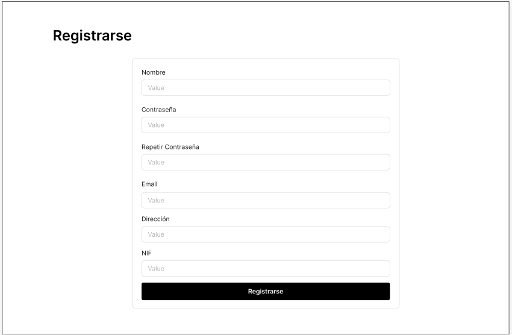

#### Log In

Form to log in.

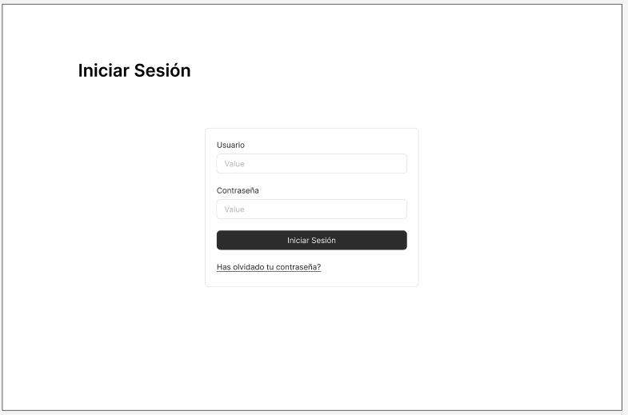

#### About Us

Section with some information about the dairy, including a map showing its location and a QR code linking to a page of interest.


#### Product

Page displaying detailed information about a cheese, its price, and—if you are a registered user—an option to add it to your order.

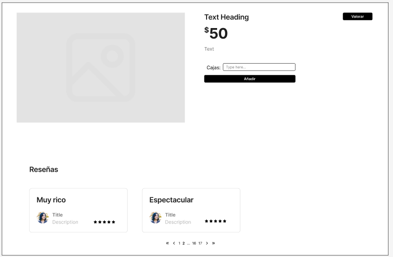

#### My Order

Section showing all the cheeses you have added to your order, from where you can send it to the company for processing.


#### Review

Small screen with a brief form for reviewing a cheese.

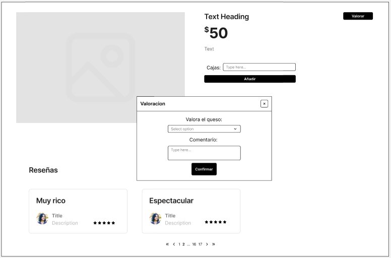

#### View Orders

Section where administrators can see all pending orders in the queue and decide whether to process them.

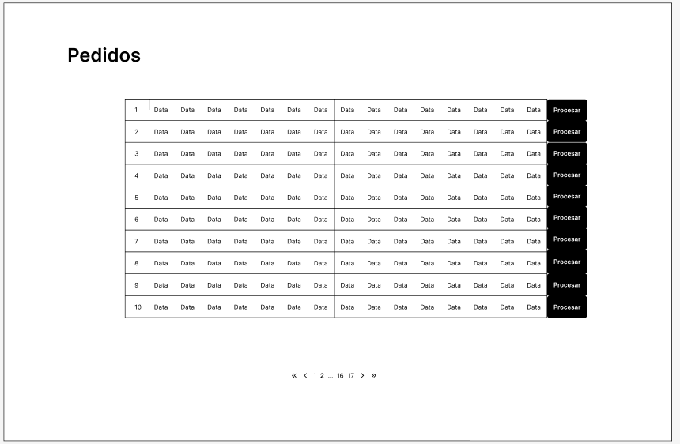

#### Process Order

Page showing a summary of the order and allowing it to be processed.

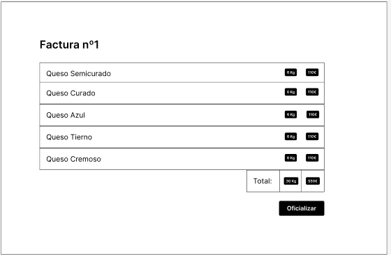

#### View Customers

Section displaying a table with all of the dairy’s customers, allowing administrators to access their profiles and ban them if necessary.

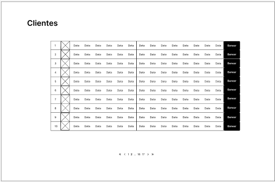

#### Invoices

Section where invoices issued by the dairy can be viewed.

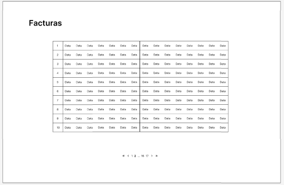

#### New Cheese

Form that allows the administrator to add a new cheese to the catalog.

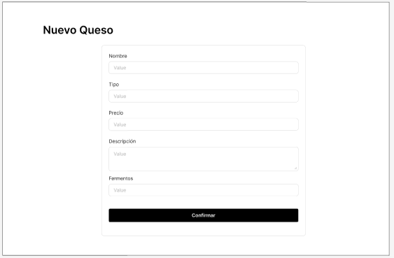

#### Stock

Section where the administrator manages the stock of existing cheeses in the catalog.


#### Charts

Page where administrators can view and analyze charts of cheese sales.

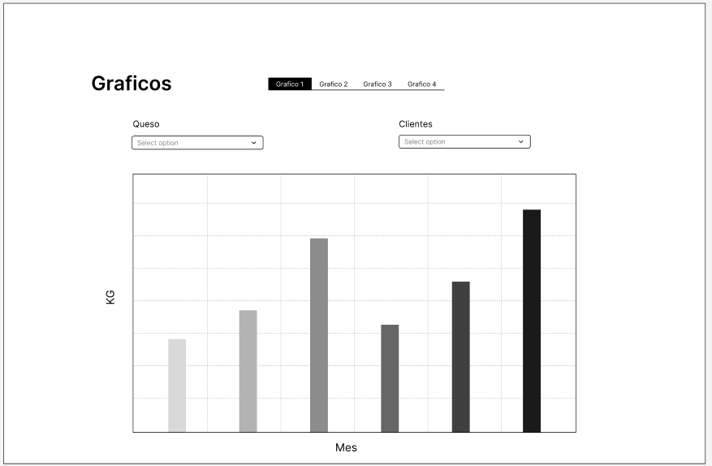

#### Error

Example of an application error and how the system notifies the user, regardless of the type of error.

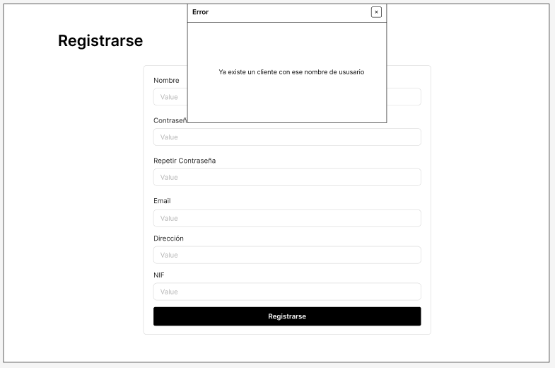

#### Navigation

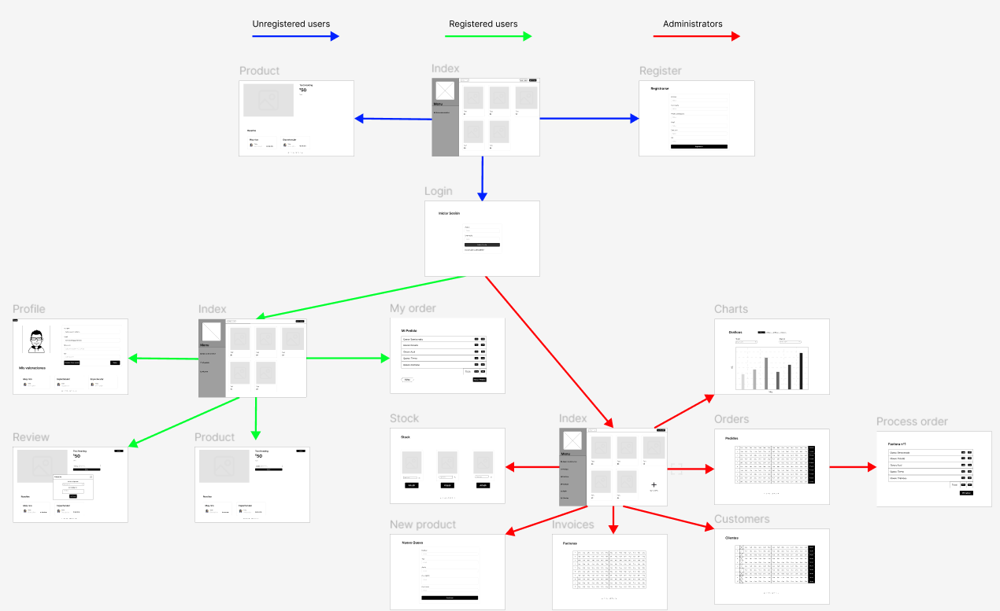

### Entities  
| Entity | Attributes | Relationships |
|---------|-----------|------------|
| User | -Id <br> -Name <br> -Password <br> -Email <br> -Address <br> -Type <br> -Tax ID <br> -Image | -Users are related to reviews <br> -Users are related to orders <br> -Users are related to invoices |
| Cheese | -Id <br> -Name <br> -Price <br> -Description <br> -Manufacturing date <br> -Expiration date <br> -Type <br> -Image <br> -Review list | -Cheeses are related to orders <br> -Cheeses are related to reviews |
| Orders | -Id <br> -Customer <br> -Cheese list | -Orders are related to users <br> -Orders are related to cheeses <br> -Orders are related to invoices |
| Invoices | -Id <br> -Invoice No. <br> -Customer <br> -Cheese list <br> -Kg <br> -Total price | -Invoices are related to users <br> -Invoices are related to orders |
| Review | -Id <br> -User <br> -Cheese <br> -Rating <br> -Comment | -Reviews are related to users <br> -Reviews are related to cheeses |


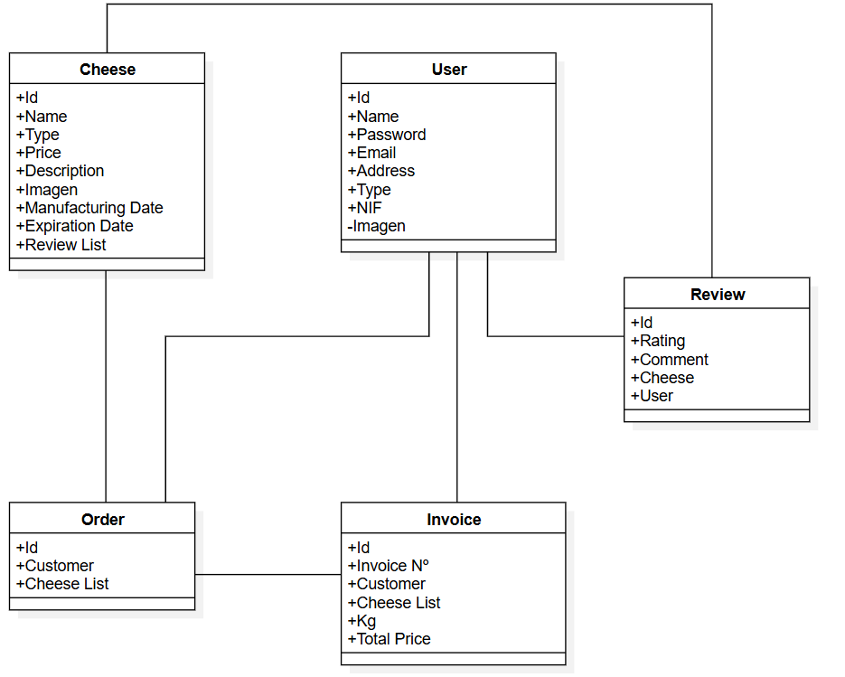

### User Permissions  

Registered users are the owners of their own reviews for each cheese; they can create, view, edit, and delete them whenever they wish.  
Users are also the owners of their active order until it is confirmed; they can edit and view it whenever they want.  
Administrators, on the other hand, can create, view, edit, and delete cheeses in the catalog.  
Administrators can convert orders into invoices and view them.  
Administrators can also ban users.  

### Images  

The Cheese and User entities will have an associated image.  

### Charts  

The charts will be bar charts, visible only to administrators. On the x-axis, the months of the year will be displayed, and on the y-axis, either the € sold each month or the Kg sold each month.  
Additionally, they can be filtered by customer (to see what each customer buys per month) and by cheese (to see how much of each cheese is sold), in order to analyze the dairy’s sales.  

### Complementary Technology  

- **Email sending:** Sending emails to customers with important messages or invoices issued by the company.  
- **PDF generation:** Generating invoices from customer orders.  
- **Use of maps:** Using Google Maps to display the dairy’s location in the "About Us" section.  

### Advanced Algorithm or Query  

On the main page, the cheeses with the highest average rating will be displayed first, with this rating calculated from customer reviews.

## Author  

The development of this application is carried out as part of the final degree project for the Software Engineering degree at the ETSII of Universidad Rey Juan Carlos in Madrid.  
Work completed by fourth-year student Víctor Bartolomé Letosa, supervised by Michel Maes Bermejo.  


